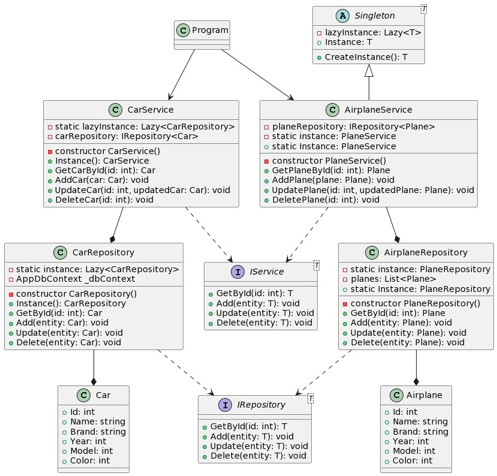

# SingletonPatternExample - Group WY_FR_JM

This repository provides an example implementation of the Repository pattern using the Singleton pattern in C# .NET 6. It includes the `CarRepository` class for data persistence and the `CarService` class for managing car entities.

## Table of Contents

- [Introduction](#introduction)
- [Features](#features)
- [Usage](#usage)
- [Requirements](#requirements)

## Introduction

The Repository pattern is a software design pattern that separates the data access logic from the business logic of an application. It provides a way to encapsulate data access operations, such as retrieving, adding, updating, and deleting entities, in a separate repository class.

The Singleton pattern ensures that there is only one instance of a class in the application. This can be useful when you want to share the same instance of a class across multiple parts of your application.

This repository includes the following classes:

- `Car`: Represents a car entity with properties such as Id, Name, Brand, and Year.
- `IRepository<T>`: An interface that defines the basic operations for a repository, such as GetById, Add, Update, and Delete.
- `CarRepository`: Implements the `IRepository<Car>` interface and provides data persistence for the `Car` entities using a List.
- `CarService`: Utilizes the `CarRepository` to perform operations on the car entities, such as retrieving, adding, updating, and deleting cars.

## Features

- Uses the Singleton pattern to ensure a single instance of the repository and service classes.
- Provides basic CRUD (Create, Read, Update, Delete) operations for managing car entities.

## Usage

Example usage in Program class

## Requirements

- NET 6 SDK or later

## Docs

